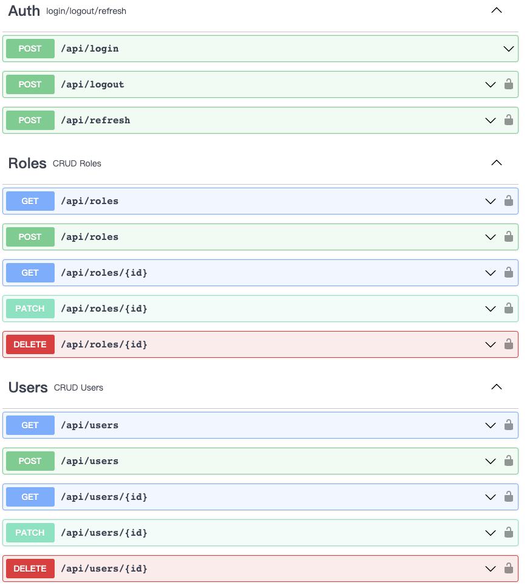

# Laravel Sample

This is a personal practice project

- Using JWT to authenticate users
- Role-based access control (RBAC)
- Providing CRUD RESTful API for users and roles 

## Version

- Laravel 9.x
- PHP 8.0
- Maria DB 10.7
- Redis 7.0

## Local Development

- Download

    `git clone git@github.com:burgess1109/laravel-sample.git`

- Copy .env.example to .env
- Install images & run containers

    `docker-composer up -d`

- Install php libraries

    `docker-compose exec php-fpm composer install`

- Generate APP_KEY

    `docker-compose exec php-fpm php artisan key:generate`

- DB initialization

    `docker-compose exec php-fpm php artisan migrate:fresh --seed`

- Open http://localhost:8080. You would see the Laravel home page if everything work fine.

## Testing

- PSR-12 lint

    `docker-compose exec php-fpm ./vendor/bin/phpcs ./`

- Feature/Unit testing

    `docker-compose exec php-fpm php artisan test`

## API Spec

Refer to [openapi.yml](./openapi.yml) to get more information
 
